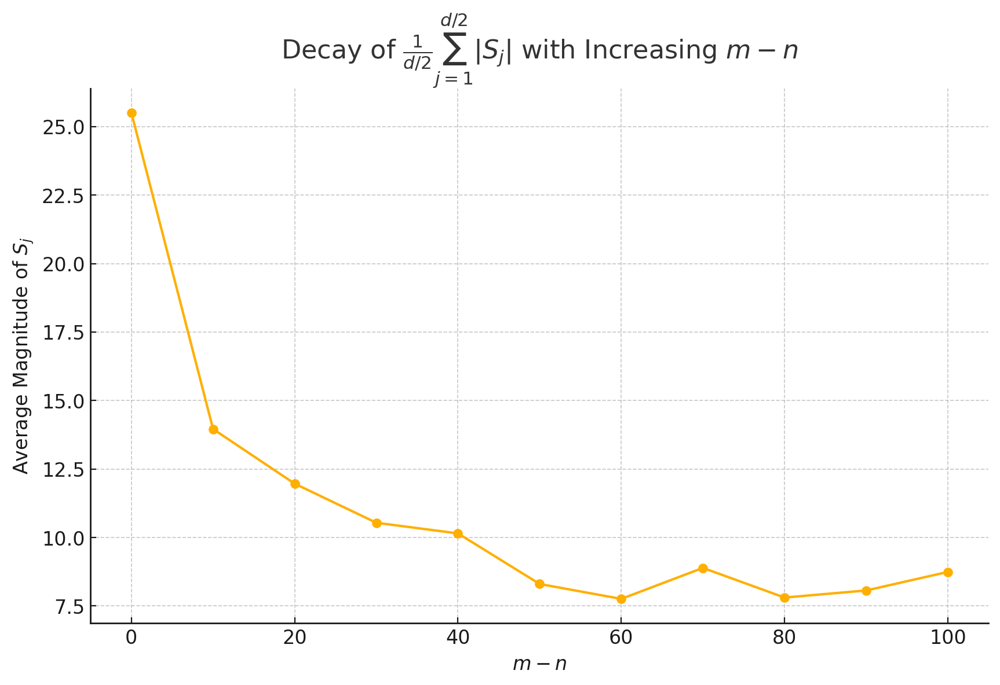

## Introduction

RoPE[^1] is the most common positional embedding method that has been applied in many popular Language Models. RoPE has several properties, among which the **long-term decay** property is really interesting. Recently, I've been researching on how to make long-term decay property more customizable and controllable. Therefore, I want to get myself really understand why RoPE has the long-term decay property and how it works. In this post, I try to provide a more intuitive understanding of the long-term decay property of RoPE, and will also cover some recent researches relevant to RoPE.

## Review | Some Details

Before getting the proof, let's first recal the **Long-term decay of RoPE** (Sec.3.4.3) in the original paper[^1]. Contents below are completely copied from the orginal paper, <u>the equation number from paper is kept.</u>

---

We can group entries of vectors $\boldsymbol{q}=\boldsymbol{W}_q \boldsymbol{x}_m$ and $\boldsymbol{k}=\boldsymbol{W}_k \boldsymbol{x}_n$ in pairs, and the inner product of RoPE in Equation (16) can be written as a complex number multiplication.

$$
\left(\boldsymbol{R}_{\Theta, m}^d \boldsymbol{W}_q \boldsymbol{x}_m\right)^{\top}\left(\boldsymbol{R}_{\Theta, n}^d \boldsymbol{W}_k \boldsymbol{x}_n\right)=\operatorname{Re}\left[\sum_{i=0}^{d / 2-1} \boldsymbol{q}_{[2 i: 2 i+1]} k_{[2 i: 2 i+1]}^* e^{i(m-n) \theta_i}\right] \tag{1 or 35}
$$

where $\boldsymbol{q}_{[2 i: 2 i+1]}$ represents the $2 i^{\text {th }}$ to $(2 i+1)^{\text {th }}$ entries of $\boldsymbol{q}$. Denote $h_i=\boldsymbol{q}_{[2 i: 2 i+1]} \boldsymbol{k}_{[2 i: 2 i+1]}^*$ and $S_j=$ $\sum_{i=0}^{j-1} e^{i(m-n) \theta_i}$, and let $h_{d / 2}=0$ and $S_0=0$, we can rewrite the summation using Abel transformation

$$
\sum_{i=0}^{d / 2-1} \boldsymbol{q}_{[2 i: 2 i+1]} \boldsymbol{k}_{[2 i: 2 i+1]}^* e^{i(m-n) \theta_i}=\sum_{i=0}^{d / 2-1} h_i\left(S_{i+1}-S_i\right)=-\sum_{i=0}^{d / 2-1} S_{i+1}\left(h_{i+1}-h_i\right) \tag{2 or 36}
$$

Thus,

$$
\begin{aligned}
\left|\sum_{i=0}^{d / 2-1} \boldsymbol{q}_{[2 i: 2 i+1]} \boldsymbol{k}_{[2 i: 2 i+1]}^* e^{i(m-n) \theta_i}\right| & =\left|\sum_{i=0}^{d / 2-1} S_{i+1}\left(h_{i+1}-h_i\right)\right| \\
& \leq \sum_{i=0}^{d / 2-1}\left|S_{i+1}\right|\left|\left(h_{i+1}-h_i\right)\right| \\
& \leq\left(\max _i\left|h_{i+1}-h_i\right|\right) \sum_{i=0}^{d / 2-1}\left|S_{i+1}\right|
\end{aligned} \tag{3 or 37}
$$

Note that the value of $\frac{1}{d / 2} \sum_{i=1}^{d / 2}\left|S_i\right|$ decay with the relative distance $m-n$ increases by setting $\theta_i=10000^{-2 i / d}$, as shown in Figure (2).

---

I believe some readers will have common questions with me, it seems in this part of paper, **many details are elliminated for simplicity.** I don't want to be the guy who just pretend these details are not important, focus on ideas, I will present more derivations here, since so far I haven't seen any detailed explanations here, including the blog of the author[^2].

Let's revise some annotation here. $\boldsymbol{R}_{\theta, m}^d$ is the following matrix:

$$
\boldsymbol{R}_{\theta, m}^d=\left(\begin{array}{ccccccc}
\cos m \theta_1 & -\sin m \theta_1 & 0 & 0 & \cdots & 0 & 0 \\
\sin m \theta_1 & \cos m \theta_1 & 0 & 0 & \cdots & 0 & 0 \\
0 & 0 & \cos m \theta_2 & -\sin m \theta_2 & \cdots & 0 & 0 \\
0 & 0 & \sin m \theta_2 & \cos m \theta_2 & \cdots & 0 & 0 \\
\vdots & \vdots & \vdots & \vdots & \ddots & \vdots & \vdots \\
0 & 0 & 0 & 0 & \cdots & \cos m \theta_{d / 2} & -\sin m \theta_{d / 2} \\
0 & 0 & 0 & 0 & \cdots & \sin m \theta_{d / 2} & \cos m \theta_{d / 2}
\end{array}\right)_{d\times d}
$$

$\theta_i$ belongs to $\Theta=\left\{\theta_i=10000^{-2(i-1) / d}, i \in[1,2, \ldots, d / 2]\right\}$​​, where 10000 is called **"base"**, as a predefined constant. The value of base will have interesting effect on RoPE, which we will discuss later.

$\boldsymbol{x}_i \in \mathbb{R}^d$ is the d-dimensional word embedding vector of token $w_i$ (Let $\mathbb{S}_N=\left\{w_i\right\}_{i=1}^N$ be a sequence of $N$ input tokens with $w_i$ being the $i^{t h}$ element. The corresponding word embedding of $\mathbb{S}_N$ is denoted as $\mathbb{E}_N=\left\{\boldsymbol{x}_i\right\}_{i=1}^N$). $\boldsymbol{q}=\boldsymbol{W}_q \boldsymbol{x}_m$ and $\boldsymbol{k}=\boldsymbol{W}_k \boldsymbol{x}_n$ are of the shape as $\boldsymbol{x_i}$.

### Derivation of Eq.(35)

**Now let's first derive Eq.(35).** We first try to get **its complete form without using complex numbers**. Each block $\boldsymbol{R_{m\theta_i}}$ in matrix $\boldsymbol{R_{\theta, m}^d}$ is a rotation matrix, where $\boldsymbol{R_{m\theta_i}}=\left(\begin{array}{cc}
\cos m \theta_1 & -\sin m \theta_1 \\
\sin m \theta_1 & \cos m \theta_1
\end{array}\right)$ means contrarotating $m\theta_1$, while

$$
{\boldsymbol{R_{n\theta_i}}}^T=\left(\begin{array}{cc}
\cos n \theta_1 & \sin n \theta_1 \\
-\sin n \theta_1 & \cos n \theta_1
\end{array}\right) = \left(\begin{array}{cc}
\cos (-n \theta_1) & - \sin (-n \theta_1) \\
\sin (-n \theta_1) & \cos (-n \theta_1)
\end{array}\right)= {\boldsymbol{R_{(-n\theta_i)}}}
$$

which means rotate $n\theta_i$ clockwise. Therefore, the LHS of Eq.(35) can be written as:

$$
\left(\boldsymbol{R}_{\Theta, m}^d \boldsymbol{W}_q \boldsymbol{x}_m\right)^{\top}\left(\boldsymbol{R}_{\Theta, n}^d \boldsymbol{W}_k \boldsymbol{x}_n\right)=\boldsymbol{q}^T\boldsymbol{R}_{\Theta, n-m}^d\boldsymbol{k}  \tag{4}
$$

It's easy to see that the RHS of Eq.(4) is a **scalar**. We focus on $\boldsymbol{q}^T\boldsymbol{R}_{\Theta, n-m}^d$ first. For index $2j, 2j+1, 0\le j\le d/2-1$ , It's easy to see that elements $[q_{2j},q_{2j+1}]$ in $\boldsymbol{q}^T$ will only interact with the block $\boldsymbol{R_{(n-m)\theta_{j+1}}}$, and we have:

$$
(\boldsymbol{q}^T\boldsymbol{R}_{\Theta, n-m}^d)[2j:2j+1] \newline = [q_{2j}cos(n-m)\theta_{j+1}+q_{2j+1}sin(n-m)\theta_{j+1}, -q_{2j}sin(n-m)\theta_{j+1}+q_{2j+1}cos(n-m)\theta_{j+1}]_{1\times 2} \tag{key}
$$

And these two elements will be multiplied with the $2j, 2j+1$ elements of $\boldsymbol{k}$, then we finally get:

$$
(q_{2j}k_{2j}+q_{2j+1}k_{2j+1})cos(n-m)\theta_{j+1}+(q_{2j+1}k_{2j}-q_{2j}k_{2j+1})sin(n-m)\theta_{j+1}
$$

Then we back to the complex number form used by authors. In Eq.(35), it's said $\boldsymbol{q}_{[2 i: 2 i+1]}\cdot k_{[2 i: 2 i+1]}$ is **operated as complex multiplication**, which means:

$$
\begin{aligned}
\boldsymbol{q}_{[2 i: 2 i+1]}\cdot k_{[2 i: 2 i+1]}^* &= (q_{2i} + iq_{2i+1})\cdot (k_{2i}+ik_{2i+1})^* \newline
&= (q_{2i}k_{2i}+q_{2i+1}k_{2i+1})+i(-q_{2i}k_{2i+1}+q_{2i+1}k_{2i})
\end{aligned} \tag{5}
$$

**_(Please don't confuse your self with the index $i$ and $i$ representing imaginary number)_**. Then if we multiply the RHS of Eq.(5) with $e^{i(m-n)\theta_i}=cos(m-n)\theta_i+i\cdot sin(m-n)\theta_i$, and focus on real part, we will magically get the Eq.(key), with $i$ substituted by $j$. It's quite elegant!

We then sum up $j$ from $0$ to $d/2-1$, then we successfully get Eq.(35).

### Derivation of Eq.(36)

The derivation of Eq.(36) is relatively simple. We just focus on $S_{i+1}$, and combine the same items will give us correct coefficient which is $h_{i+1}-h_i$. Then we sum up $i$ from $0$ to $d/2-1$, and we get Eq.(36). See [Wikipedia](https://en.wikipedia.org/wiki/Summation_by_parts) for more details about Abel transformation.

### Why Long-term Decay?

Well, then we arrive at the most important part, we try to understand why the value of $\frac{1}{d / 2} \sum_{j=1}^{d / 2}\left|S_j\right|$ decay with the relative distance $m-n$ increases by setting $\theta_i=10000^{-2 i / d}$, where $S_j=$ $\sum_{i=0}^{j-1} e^{i(m-n) \theta_i}$. This property could also be described as "the closer token gets more attention: the current token tends to pay more attention to the token that has a smaller relative distance", as discussed in Sec.4 of this paper[^4].

It's acutally very hard to analyze by taking derivative of $(m-n)$, since we cannot easily find the analytical solution of.

One intuitive way to understand is to take the sum of $e^{i(m-n)\theta_i}$ as walking on a plane, which is the geometric meaning of adding two vectors. Apparently, when $m-n$ is close to zero, then we almost walking in a constant direction, which makes the sum of $e^{i(m-n)\theta_i}$ large. However, when $m-n$ is large, then the sum of $e^{i(m-n)\theta_i}$ will be small, since we are walking in different directions, with the worst case where we are walking in a circle.

**The Concept of Phase Cancellation**

Phase cancellation occurs when complex exponentials (vectors on the unit circle in the complex plane) with differing directions are summed together. The result can be a vector with a smaller magnitude than the individual vectors due to the geometric addition properties of complex numbers.

**The Sum $S_j$**

Recall:
$$S_j = \sum_{i=0}^{j-1} e^{i(m-n) \theta_i}$$
with $\theta_i = 10000^{-2i/d}$.

**Examining the Phases**

1. **Distribution of Phases**:

   - The phases $(m-n)\theta_i$ for each term in the sum depend on both $m-n$ and $i$.
   - As $m-n$ increases, the value of $(m-n)\theta_i$ changes more rapidly due to the exponential nature of $\theta_i$.
   - For a fixed large $m-n$, the phases $(m-n)\theta_i$ effectively **"scan"** a broader range of angles on the unit circle as $i$ varies.

2. **Uniform Distribution Assumption**:
   - If $m-n$ is sufficiently large and $i$ ranges over a significant interval, $(m-n)\theta_i$ can cover the interval $[0, 2\pi]$ multiple times, depending on $m-n$, effectively randomizing the phase angles.
   - Under this assumption, the phases of the terms in $S_j$ can be seen as being uniformly distributed across $[0, 2\pi]$.

**Illustrating Cancellation**

- **Cancellation Through Averaging**:

  - If the phases of $e^{i(m-n) \theta_i}$ are uniformly distributed or nearly so, the expected value of their sum approaches zero:
    $$E\left[\sum_{i=0}^{j-1} e^{i(m-n) \theta_i}\right] = \sum_{i=0}^{j-1} E[e^{i(m-n) \theta_i}] = \sum_{i=0}^{j-1} \int_0^{2\pi} e^{i\phi} \frac{d\phi}{2\pi} = 0$$
  - Intuitively speaking, $E[e^{i\phi}]$ over $[0, 2\pi]$ is zero because for every vector, there is another vector pointing in the opposite direction, cancelling out.

- **Expected Magnitude with High Variability**:
  - While the average expected value is zero, individual realizations of $S_j$ can vary widely, typically resulting in smaller magnitudes as more vectors are added due to increasing likelihood of opposite directions.
  - The more terms added (i.e., larger $j$), the greater the potential for cancellation, especially when $(m-n)\theta_i$ provides a full or multiple rotations around the circle.

## Surveying

### 1.The Influence of Base Choice on Long-term Decay

For same $i$ and $d$, larger base will make the $\theta_i=base^{-2(i-1)/d}$ smaller. According to the blog here[^3], too small base (e.g. 1) will completely destroy the long-term decay property, **while too large base will also decrease the long-term decay property.** However, it's argued in aother work that to achieve longer context we need to have larger base[^4], more detailed results from this paper are illustrated by this table:

$$
\begin{array}{|c|c|}
\hline \text { Questions } & \text { Answers } \\
\hline \begin{array}{l}
\text { Q: Does RoPE's base bounds the context } \\
\text { length during the fine-tuning stage? }
\end{array} & \begin{array}{l}
\text { Yes. When the base is small, it is difficult to get extrapolation } \\
\text { for specific context length. }
\end{array} \\
\hline \begin{array}{l}
\text { Q: Does RoPE's base bounds the context } \\
\text { length during the pre-training stage? }
\end{array} & \begin{array}{l}
\text { Yes. Our proposed lower bound for RoPE's base also applies } \\
\text { to pre-training. If we train a model from scratch with a small } \\
\text { base but the context length is large (larger than the bounded } \\
\text { length), the resulting model has very limited the context length } \\
\text { capabilities, meaning some of context in pre-training is wasted. }
\end{array} \\
\hline \begin{array}{l}
\text { Q: What happened when base is set } \\
\text { smaller than the lower bound? }
\end{array} & \begin{array}{l}
\text { The model will get the superficial long context capability. } \\
\text { The model can keep perplexity low, but can't retrieve useful } \\
\text { information from long context. }
\end{array} \\
\hline
\end{array}
$$

2. ### Long-term Decay of the Ability to Attend More to Similar Tokens than Random Tokens

Theorem[^4]: Assuming that the components of query $q \in R^d$ and key $k \in R^d$ are independent and identically distributed, their standard deviations are denoted as $\sigma \in R$. The key $k^*=q+\epsilon$ is a token similar to the query, where $\epsilon$ is a random variable with a mean of 0 . Then we have:

$$
\frac{1}{2 \sigma^2}\left(\mathbb{E}_{q, k^*}\left[q^T R_{m, \theta} k^*\right]-\mathbb{E}_{q, k}\left[q^T R_{m, \theta} k\right]\right)=\sum_{i=0}^{d / 2-1} \cos \left(m \theta_i\right)
$$

3. ### The perplexity cannot be used to evaluate long context capabilities

As indicated in [^4], perplexity is not a good metric to evaluate the long context capabilities of a model. In [Long-Eval](https://github.com/DachengLi1/LongChat/tree/longeval) bench, a model with small perplexity could have very low accuracy.

## Desserts

Jianlin Su is a very talented guy, his Blogs are all very insightful. Among his numerous blogs, a series called "To upgrade Transformer" **(Transformer 升级之路)** really deserve an In-depth reading. Here I curate a list, since the search engine in the blog website seems not to work well.

[Transformer 升级之路：2、博采众长的旋转式位置编码](https://spaces.ac.cn/archives/8265)

- This blog introduces RoPE.

[Transformer升级之路：4、二维位置的旋转式位置编码](https://spaces.ac.cn/archives/8397)
- This blog introduces 2D RoPE, which could be applied in ViT.

[Transformer 升级之路：7、长度外推性与局部注意力](https://spaces.ac.cn/archives/9431)

[Transformer 升级之路：9、一种全局长度外推的新思路](https://spaces.ac.cn/archives/9603)

[Transformer 升级之路：10、RoPE 是一种 β 进制编码](https://spaces.ac.cn/archives/9675)

[Transformer升级之路：17、多模态位置编码的简单思考](https://spaces.ac.cn/archives/10040)

[Transformer 升级之路：18、RoPE 的底数选择原则](https://spaces.ac.cn/archives/10122)

[^1]: Su, Jianlin, et al. "Roformer: Enhanced transformer with rotary position embedding." Neurocomputing 568 (2024): 127063.
[^2]: 苏剑林. (Mar. 23, 2021). 《Transformer 升级之路：2、博采众长的旋转式位置编码 》[Blog post]. Retrieved from https://spaces.ac.cn/archives/8265
[^3]: https://clvsit.github.io/RoPE-%E7%9B%B8%E5%AF%B9%E4%BD%8D%E7%BD%AE%E7%BC%96%E7%A0%81%E8%A7%A3%E8%AF%BB%E4%B8%8E%E5%A4%96%E6%8E%A8%E6%80%A7%E7%A0%94%E7%A9%B6/
[^4]: Men, Xin, et al. "Base of RoPE Bounds Context Length." arXiv preprint arXiv:2405.14591 (2024).

Still updating.....
